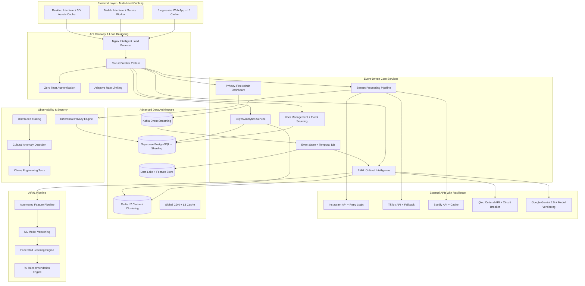
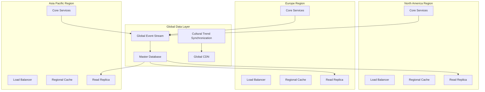

# CulturalOS Platform Design Document

## Overview

CulturalOS is a sophisticated cultural intelligence platform built on a modern microservices architecture that processes social media behavior, predicts cultural evolution, and delivers personalized insights through an interactive 3D interface. The platform serves both consumer and enterprise markets with real-time analytics, AI-powered recommendations, and privacy-compliant admin dashboards.

### Key Design Principles

- **Privacy-First**: All user data is anonymized for admin analytics while maintaining personalized experiences
- **Real-Time Performance**: Sub-100ms response times for cached data, sub-500ms for complex analysis
- **Scalable Architecture**: Horizontal scaling to support 10K+ concurrent users and 1M+ daily data points
- **Immersive Experience**: 3D visualizations with modern, clean light UI design
- **AI-Powered Insights**: Gemini 2.5 integration for cultural explanations and personalized advice

## Architecture

### Advanced System Design Patterns

The CulturalOS platform incorporates cutting-edge system design patterns for maximum scalability, performance, and reliability:

#### 1. Event Sourcing & CQRS Architecture
- **Event Sourcing**: All cultural data changes stored as immutable events for perfect audit trails
- **CQRS**: Separate read/write models - write optimized for data ingestion, read optimized for 3D visualizations
- **Event Store**: Temporal database for cultural evolution replay and historical analysis
- **Projection Services**: Real-time view generation for different user interfaces

#### 2. Data Lake & Feature Store Architecture
- **Raw Data Lake**: Unprocessed social media data for future ML training and analysis
- **Feature Store**: Pre-computed cultural features with versioning and lineage tracking
- **Data Mesh**: Decentralized data ownership by domain (Instagram, TikTok, Spotify)
- **Lambda Architecture**: Batch and stream processing for comprehensive cultural intelligence

#### 3. Advanced Privacy & Security Patterns
- **Differential Privacy**: Mathematical noise addition to admin analytics while preserving accuracy
- **Homomorphic Encryption**: Cultural analysis on encrypted data without decryption
- **Zero-Knowledge Proofs**: Verify cultural insights without revealing underlying data
- **Zero Trust Architecture**: Verify every cultural data access request regardless of source

#### 4. Intelligent Caching & Performance
- **Multi-Level Caching Strategy**:
  - L1: Browser cache for 3D assets and static cultural data
  - L2: Redis for user sessions and frequently accessed insights
  - L3: CDN for global cultural trend data
- **Cache Invalidation**: Event-driven updates when cultural patterns change
- **Connection Pooling**: Optimized database connections for high-throughput analysis

#### 5. Advanced Real-Time Processing
- **Stream Processing**: Apache Kafka for cultural event streaming
- **Complex Event Processing**: Multi-platform cultural trend pattern detection
- **Temporal Databases**: Time-series cultural data with advanced temporal querying
- **Event-Driven Microservices**: React to cultural changes in real-time

#### 6. AI/ML Enhancement Patterns
- **Feature Pipeline**: Automated cultural feature extraction and validation
- **Model Versioning**: A/B test different cultural intelligence algorithms
- **Federated Learning**: Train cultural models without centralizing user data
- **Reinforcement Learning**: Optimize recommendations based on user feedback

#### 7. Resilience & Observability
- **Circuit Breaker Pattern**: Prevent cascade failures during high cultural event periods
- **Bulkhead Pattern**: Isolate cultural analysis failures from user interface
- **Distributed Tracing**: Track cultural analysis requests across microservices
- **Chaos Engineering**: Test system resilience during cultural trend spikes

### Enhanced High-Level Architecture



### Geo-Distributed Architecture



### Advanced Service Architecture Patterns

#### Event Sourcing & CQRS Implementation

```python
# Event Store for Cultural Intelligence
class CulturalEvent:
    event_id: UUID
    user_id: UUID
    event_type: str
    event_data: Dict
    timestamp: datetime
    version: int

class CulturalEventStore:
    async def append_event(self, event: CulturalEvent) -> None:
        """Append immutable cultural event to event store."""
        pass
    
    async def get_events(self, user_id: UUID, from_version: int = 0) -> List[CulturalEvent]:
        """Retrieve cultural events for replay and analysis."""
        pass

# CQRS Read/Write Models
class CulturalWriteModel:
    """Optimized for data ingestion and event processing."""
    async def process_social_media_data(self, data: SocialMediaData) -> None:
        events = self.extract_cultural_events(data)
        for event in events:
            await self.event_store.append_event(event)

class CulturalReadModel:
    """Optimized for 3D visualizations and analytics queries."""
    async def get_cultural_evolution_3d(self, user_id: UUID) -> CulturalEvolution3DData:
        """Generate 3D visualization data from event projections."""
        pass
```

#### Data Lake & Feature Store Architecture

```python
# Feature Store for ML-Ready Cultural Features
class CulturalFeatureStore:
    async def store_features(self, user_id: UUID, features: Dict) -> None:
        """Store versioned cultural features for ML models."""
        pass
    
    async def get_features(self, user_id: UUID, feature_names: List[str]) -> Dict:
        """Retrieve features for real-time cultural intelligence."""
        pass

# Data Mesh Implementation
class InstagramDataDomain:
    """Domain-specific data ownership for Instagram cultural data."""
    async def process_instagram_data(self, raw_data: Dict) -> CulturalFeatures:
        pass

class TikTokDataDomain:
    """Domain-specific data ownership for TikTok cultural data."""
    async def process_tiktok_data(self, raw_data: Dict) -> CulturalFeatures:
        pass
```

#### Advanced Privacy & Security Implementation

```python
# Differential Privacy for Admin Analytics
class DifferentialPrivacyEngine:
    def __init__(self, epsilon: float = 1.0):
        self.epsilon = epsilon  # Privacy budget
    
    async def add_noise_to_analytics(self, raw_data: Dict) -> Dict:
        """Add calibrated noise while preserving statistical accuracy."""
        noisy_data = {}
        for key, value in raw_data.items():
            if isinstance(value, (int, float)):
                noise = np.random.laplace(0, 1/self.epsilon)
                noisy_data[key] = max(0, value + noise)
            else:
                noisy_data[key] = value
        return noisy_data

# Zero Trust Authentication
class ZeroTrustAuth:
    async def verify_request(self, request: Request) -> bool:
        """Verify every cultural data access request."""
        # Verify user identity
        user_verified = await self.verify_user_identity(request)
        # Verify device trust
        device_verified = await self.verify_device_trust(request)
        # Verify request context
        context_verified = await self.verify_request_context(request)
        
        return user_verified and device_verified and context_verified
```

#### Intelligent Load Balancing & Performance

```python
# Consistent Hashing for Cultural Profile Routing
class CulturalConsistentHashing:
    def __init__(self, servers: List[str]):
        self.servers = servers
        self.hash_ring = self._build_hash_ring()
    
    def get_server_for_user(self, user_id: str) -> str:
        """Route users to servers based on cultural profile similarity."""
        user_hash = hashlib.md5(user_id.encode()).hexdigest()
        return self._find_closest_server(user_hash)

# Adaptive Load Balancing with ML
class MLLoadBalancer:
    async def predict_traffic(self, time_window: int) -> Dict[str, float]:
        """ML-based traffic prediction for resource allocation."""
        pass
    
    async def scale_services(self, predictions: Dict[str, float]) -> None:
        """Auto-scale services based on cultural event predictions."""
        pass
```

#### Advanced Real-Time Processing Architecture

```python
# Complex Event Processing for Cultural Trends
class CulturalEventProcessor:
    async def detect_cultural_patterns(self, events: List[CulturalEvent]) -> List[CulturalPattern]:
        """Detect complex cultural patterns across multiple platforms."""
        patterns = []
        
        # Cross-platform correlation analysis
        cross_platform_events = self.group_by_timeframe(events)
        for timeframe, grouped_events in cross_platform_events.items():
            if self.has_cross_platform_correlation(grouped_events):
                pattern = CulturalPattern(
                    type="cross_platform_trend",
                    confidence=self.calculate_confidence(grouped_events),
                    platforms=self.extract_platforms(grouped_events)
                )
                patterns.append(pattern)
        
        return patterns

# Stream Processing with Kafka
class CulturalStreamProcessor:
    def __init__(self):
        self.kafka_consumer = KafkaConsumer('cultural-events')
        self.kafka_producer = KafkaProducer()
    
    async def process_cultural_stream(self) -> None:
        """Process real-time cultural events from Kafka stream."""
        async for message in self.kafka_consumer:
            cultural_event = CulturalEvent.from_json(message.value)
            
            # Real-time pattern analysis
            patterns = await self.analyze_patterns(cultural_event)
            
            # Publish insights to real-time dashboard
            for pattern in patterns:
                await self.kafka_producer.send('cultural-insights', pattern.to_json())
```

### Service Architecture Pattern

The platform follows a **Domain-Driven Design (DDD)** approach with advanced patterns:

1. **Authentication Domain**: Zero Trust architecture with passkey and Google OAuth
2. **Data Ingestion Domain**: Event-driven stream processing with data mesh
3. **Cultural Intelligence Domain**: CQRS pattern with ML feature store
4. **Analytics Domain**: Differential privacy with OLAP cubes
5. **Admin Domain**: Privacy-first monitoring with distributed tracing

## Components and Interfaces

### Frontend Architecture

```
src/
├── components/
│   ├── ui/                    # Reusable UI components
│   │   ├── Button3D.tsx       # 3D interactive buttons
│   │   ├── Card3D.tsx         # 3D cards with depth effects
│   │   ├── Modal3D.tsx        # 3D modal overlays
│   │   └── Navigation3D.tsx   # 3D navigation elements
│   ├── features/              # Feature-specific components
│   │   ├── auth/              # Authentication components
│   │   ├── dashboard/         # Dashboard widgets
│   │   ├── analytics/         # Analytics visualizations
│   │   └── admin/             # Admin panel components
│   ├── layouts/               # Page layouts
│   │   ├── MainLayout.tsx     # Primary app layout
│   │   ├── DashboardLayout.tsx # Dashboard-specific layout
│   │   └── AdminLayout.tsx    # Admin panel layout
│   └── charts/                # 3D Data visualization components
│       ├── CulturalEvolution3D.tsx    # 3D timeline visualization
│       ├── InfluenceNetwork3D.tsx     # 3D network mapping
│       ├── DiversityScore3D.tsx       # 3D scoring visualization
│       └── TrendPrediction3D.tsx      # 3D trend forecasting
├── hooks/                     # Custom React hooks
│   ├── useAuth.ts             # Authentication state management
│   ├── useCulturalData.ts     # Cultural data fetching
│   ├── useRealTime.ts         # WebSocket connections
│   └── use3DInteraction.ts    # 3D interaction handling
├── services/                  # API service layer
│   ├── authService.ts         # Authentication API calls
│   ├── culturalService.ts     # Cultural intelligence APIs
│   ├── analyticsService.ts    # Analytics data fetching
│   └── adminService.ts        # Admin dashboard APIs
├── store/                     # State management (Zustand)
│   ├── authStore.ts           # Authentication state
│   ├── culturalStore.ts       # Cultural data state
│   ├── uiStore.ts             # UI state (theme, 3D settings)
│   └── adminStore.ts          # Admin dashboard state
├── utils/                     # Utility functions
│   ├── 3dHelpers.ts           # 3D visualization utilities
│   ├── culturalAnalysis.ts    # Cultural data processing
│   ├── privacyHelpers.ts      # Data anonymization utilities
│   └── performanceUtils.ts    # Performance optimization
├── types/                     # TypeScript definitions
│   ├── auth.types.ts          # Authentication types
│   ├── cultural.types.ts      # Cultural data types
│   ├── analytics.types.ts     # Analytics types
│   └── admin.types.ts         # Admin dashboard types
└── pages/                     # Route components
    ├── Dashboard.tsx          # Main user dashboard
    ├── Analytics.tsx          # User analytics page
    ├── Enterprise.tsx         # Enterprise dashboard
    └── Admin.tsx              # Admin panel
```

### Backend Architecture

```
app/
├── api/
│   ├── routes/                # API endpoint definitions
│   │   ├── auth.py            # Authentication endpoints
│   │   ├── cultural.py        # Cultural intelligence endpoints
│   │   ├── analytics.py       # Analytics endpoints
│   │   ├── admin.py           # Admin dashboard endpoints
│   │   └── websocket.py       # WebSocket endpoints
│   ├── dependencies/          # Dependency injection
│   │   ├── auth.py            # Authentication dependencies
│   │   ├── database.py        # Database dependencies
│   │   └── permissions.py     # Role-based access control
│   └── middleware/            # Custom middleware
│       ├── cors.py            # CORS handling
│       ├── rate_limiting.py   # Rate limiting middleware
│       └── privacy.py         # Data anonymization middleware
├── core/
│   ├── config.py              # Configuration management
│   ├── security.py            # Security utilities
│   └── database.py            # Database connections
├── models/                    # Data models
│   ├── user.py                # User models
│   ├── cultural_data.py       # Cultural intelligence models
│   ├── analytics.py           # Analytics models
│   └── admin.py               # Admin models
├── services/                  # Business logic layer
│   ├── auth_service.py        # Authentication logic
│   ├── cultural_service.py    # Cultural intelligence processing
│   ├── analytics_service.py   # Analytics generation
│   ├── admin_service.py       # Admin dashboard logic
│   └── privacy_service.py     # Data anonymization service
├── integrations/              # External API integrations
│   ├── social_media/          # Social media API clients
│   │   ├── instagram.py       # Instagram API integration
│   │   ├── tiktok.py          # TikTok API integration
│   │   └── spotify.py         # Spotify API integration
│   ├── qloo_client.py         # Qloo Cultural Intelligence API
│   └── gemini_client.py       # Google Gemini 2.5 API
└── utils/                     # Utility functions
    ├── cultural_analysis.py   # Cultural pattern analysis
    ├── privacy_utils.py       # Privacy and anonymization
    └── performance_utils.py   # Performance optimization
```

### Key Interface Definitions

#### Cultural Intelligence Interface
```typescript
interface CulturalProfile {
  userId: string;
  culturalDiversityScore: number;
  evolutionTimeline: CulturalMilestone[];
  influenceNetwork: InfluenceNode[];
  blindSpots: CulturalBlindSpot[];
  recommendations: CulturalRecommendation[];
  predictionAccuracy: number;
}

interface CulturalMilestone {
  timestamp: Date;
  event: string;
  culturalShift: number;
  confidence: number;
  platforms: SocialPlatform[];
}

interface InfluenceNode {
  source: string;
  influence: number;
  category: CulturalCategory;
  connections: string[];
}
```

#### 3D Visualization Interface
```typescript
interface Visualization3DProps {
  data: CulturalData;
  interactionMode: '3d' | '2d';
  theme: 'light' | 'dark';
  animations: boolean;
  onDataPointClick: (point: DataPoint) => void;
  onHover: (point: DataPoint | null) => void;
}

interface CulturalEvolution3DData {
  timeline: TimelinePoint[];
  milestones: Milestone3D[];
  predictions: PredictionPoint[];
  confidence: ConfidenceRegion[];
}
```

## Data Models

### User Profile Schema

```sql
-- Users table with authentication
CREATE TABLE users (
    id UUID PRIMARY KEY DEFAULT gen_random_uuid(),
    email VARCHAR(255) UNIQUE NOT NULL,
    passkey_credential TEXT, -- Passkey authentication data
    google_id VARCHAR(255), -- Google OAuth ID
    role user_role NOT NULL DEFAULT 'consumer',
    subscription_tier subscription_type NOT NULL DEFAULT 'free',
    privacy_settings JSONB DEFAULT '{}',
    created_at TIMESTAMP WITH TIME ZONE DEFAULT NOW(),
    updated_at TIMESTAMP WITH TIME ZONE DEFAULT NOW()
);

-- Cultural profiles
CREATE TABLE cultural_profiles (
    id UUID PRIMARY KEY DEFAULT gen_random_uuid(),
    user_id UUID REFERENCES users(id) ON DELETE CASCADE,
    diversity_score DECIMAL(5,2) DEFAULT 0.0,
    evolution_data JSONB DEFAULT '{}',
    influence_network JSONB DEFAULT '{}',
    blind_spots JSONB DEFAULT '[]',
    last_analysis TIMESTAMP WITH TIME ZONE,
    created_at TIMESTAMP WITH TIME ZONE DEFAULT NOW(),
    updated_at TIMESTAMP WITH TIME ZONE DEFAULT NOW()
);

-- Social media connections
CREATE TABLE social_connections (
    id UUID PRIMARY KEY DEFAULT gen_random_uuid(),
    user_id UUID REFERENCES users(id) ON DELETE CASCADE,
    platform social_platform NOT NULL,
    platform_user_id VARCHAR(255) NOT NULL,
    access_token TEXT NOT NULL,
    refresh_token TEXT,
    token_expires_at TIMESTAMP WITH TIME ZONE,
    connection_status connection_status DEFAULT 'active',
    last_sync TIMESTAMP WITH TIME ZONE,
    created_at TIMESTAMP WITH TIME ZONE DEFAULT NOW()
);
```

### Cultural Data Schema

```sql
-- Cultural data points from social media
CREATE TABLE cultural_data_points (
    id UUID PRIMARY KEY DEFAULT gen_random_uuid(),
    user_id UUID REFERENCES users(id) ON DELETE CASCADE,
    platform social_platform NOT NULL,
    data_type cultural_data_type NOT NULL,
    content JSONB NOT NULL,
    cultural_signals JSONB DEFAULT '{}',
    confidence_score DECIMAL(5,2) DEFAULT 0.0,
    processed_at TIMESTAMP WITH TIME ZONE DEFAULT NOW(),
    created_at TIMESTAMP WITH TIME ZONE DEFAULT NOW()
);

-- Cultural evolution tracking
CREATE TABLE cultural_evolution (
    id UUID PRIMARY KEY DEFAULT gen_random_uuid(),
    user_id UUID REFERENCES users(id) ON DELETE CASCADE,
    milestone_type VARCHAR(100) NOT NULL,
    cultural_shift DECIMAL(5,2) NOT NULL,
    confidence DECIMAL(5,2) NOT NULL,
    platforms social_platform[] DEFAULT '{}',
    metadata JSONB DEFAULT '{}',
    occurred_at TIMESTAMP WITH TIME ZONE NOT NULL,
    created_at TIMESTAMP WITH TIME ZONE DEFAULT NOW()
);

-- Cultural recommendations
CREATE TABLE cultural_recommendations (
    id UUID PRIMARY KEY DEFAULT gen_random_uuid(),
    user_id UUID REFERENCES users(id) ON DELETE CASCADE,
    recommendation_type recommendation_type NOT NULL,
    title VARCHAR(255) NOT NULL,
    description TEXT,
    confidence_score DECIMAL(5,2) NOT NULL,
    cultural_category VARCHAR(100),
    external_data JSONB DEFAULT '{}',
    status recommendation_status DEFAULT 'pending',
    expires_at TIMESTAMP WITH TIME ZONE,
    created_at TIMESTAMP WITH TIME ZONE DEFAULT NOW()
);
```

### Enterprise Schema

```sql
-- Enterprise organizations
CREATE TABLE organizations (
    id UUID PRIMARY KEY DEFAULT gen_random_uuid(),
    name VARCHAR(255) NOT NULL,
    domain VARCHAR(255) UNIQUE,
    subscription_tier enterprise_tier NOT NULL,
    settings JSONB DEFAULT '{}',
    created_at TIMESTAMP WITH TIME ZONE DEFAULT NOW(),
    updated_at TIMESTAMP WITH TIME ZONE DEFAULT NOW()
);

-- Team cultural analytics
CREATE TABLE team_analytics (
    id UUID PRIMARY KEY DEFAULT gen_random_uuid(),
    organization_id UUID REFERENCES organizations(id) ON DELETE CASCADE,
    team_name VARCHAR(255) NOT NULL,
    cultural_metrics JSONB NOT NULL,
    diversity_scores JSONB NOT NULL,
    trend_analysis JSONB NOT NULL,
    generated_at TIMESTAMP WITH TIME ZONE DEFAULT NOW(),
    created_at TIMESTAMP WITH TIME ZONE DEFAULT NOW()
);
```

### Admin Analytics Schema (Privacy-Compliant)

```sql
-- Anonymized platform analytics
CREATE TABLE platform_analytics (
    id UUID PRIMARY KEY DEFAULT gen_random_uuid(),
    metric_type analytics_metric_type NOT NULL,
    aggregated_data JSONB NOT NULL, -- No individual user data
    demographic_breakdown JSONB DEFAULT '{}', -- Anonymized demographics
    time_period DATERANGE NOT NULL,
    generated_at TIMESTAMP WITH TIME ZONE DEFAULT NOW()
);

-- System health metrics
CREATE TABLE system_health (
    id UUID PRIMARY KEY DEFAULT gen_random_uuid(),
    service_name VARCHAR(100) NOT NULL,
    metrics JSONB NOT NULL,
    alerts JSONB DEFAULT '[]',
    recorded_at TIMESTAMP WITH TIME ZONE DEFAULT NOW()
);
```

## Error Handling

### Error Response Structure

```typescript
interface APIError {
  code: string;
  message: string;
  details?: Record<string, any>;
  timestamp: string;
  requestId: string;
}

// Error codes
enum ErrorCodes {
  // Authentication errors
  AUTH_INVALID_CREDENTIALS = 'AUTH_001',
  AUTH_TOKEN_EXPIRED = 'AUTH_002',
  AUTH_INSUFFICIENT_PERMISSIONS = 'AUTH_003',
  
  // Data processing errors
  DATA_INGESTION_FAILED = 'DATA_001',
  DATA_ANALYSIS_TIMEOUT = 'DATA_002',
  DATA_INVALID_FORMAT = 'DATA_003',
  
  // External API errors
  EXTERNAL_API_RATE_LIMIT = 'EXT_001',
  EXTERNAL_API_UNAVAILABLE = 'EXT_002',
  EXTERNAL_API_INVALID_RESPONSE = 'EXT_003',
  
  // Privacy and compliance errors
  PRIVACY_VIOLATION = 'PRIV_001',
  GDPR_COMPLIANCE_ERROR = 'PRIV_002'
}
```

### Error Handling Strategy

1. **Graceful Degradation**: When external APIs fail, provide cached data or alternative insights
2. **Retry Logic**: Exponential backoff for transient failures
3. **Circuit Breaker**: Prevent cascade failures in microservices
4. **User-Friendly Messages**: Convert technical errors to actionable user guidance
5. **Privacy Protection**: Never expose sensitive data in error messages

## Testing Strategy

### Frontend Testing

```typescript
// Component testing with 3D interactions
describe('CulturalEvolution3D', () => {
  it('should render 3D timeline with cultural milestones', () => {
    const mockData = createMockCulturalData();
    render(<CulturalEvolution3D data={mockData} />);
    
    expect(screen.getByTestId('3d-timeline')).toBeInTheDocument();
    expect(screen.getAllByTestId('milestone-node')).toHaveLength(5);
  });
  
  it('should handle 3D interaction events', async () => {
    const onDataPointClick = jest.fn();
    render(<CulturalEvolution3D onDataPointClick={onDataPointClick} />);
    
    const dataPoint = screen.getByTestId('milestone-node-0');
    await user.click(dataPoint);
    
    expect(onDataPointClick).toHaveBeenCalledWith(expect.objectContaining({
      id: 'milestone-0',
      culturalShift: 0.75
    }));
  });
});

// Real-time data testing
describe('useRealTime hook', () => {
  it('should establish WebSocket connection and receive updates', async () => {
    const { result } = renderHook(() => useRealTime('cultural-updates'));
    
    act(() => {
      mockWebSocket.emit('cultural-insight', {
        userId: 'test-user',
        insight: 'New cultural trend detected'
      });
    });
    
    await waitFor(() => {
      expect(result.current.lastMessage).toEqual(
        expect.objectContaining({
          type: 'cultural-insight'
        })
      );
    });
  });
});
```

### Backend Testing

```python
# Cultural intelligence service testing
class TestCulturalService:
    async def test_analyze_cultural_patterns(self):
        """Test cultural pattern analysis with mock social media data."""
        service = CulturalService()
        mock_data = create_mock_social_data()
        
        result = await service.analyze_patterns(mock_data)
        
        assert result.diversity_score >= 0.0
        assert result.diversity_score <= 1.0
        assert len(result.cultural_signals) > 0
        assert result.confidence_score > 0.5
    
    async def test_privacy_compliance_in_admin_analytics(self):
        """Ensure admin analytics contain no individual user data."""
        admin_service = AdminService()
        
        analytics = await admin_service.get_platform_analytics()
        
        # Verify no individual user identifiers
        assert 'user_id' not in str(analytics)
        assert 'email' not in str(analytics)
        assert analytics['aggregated_data']['total_users'] > 0
        assert 'demographic_breakdown' in analytics
```

### Integration Testing

```python
# End-to-end cultural intelligence flow
class TestCulturalIntelligenceFlow:
    async def test_complete_cultural_analysis_flow(self):
        """Test complete flow from data ingestion to 3D visualization."""
        # 1. Ingest social media data
        ingestion_result = await ingest_social_data(
            user_id="test-user",
            platform="instagram",
            data=mock_instagram_data
        )
        
        # 2. Process cultural patterns
        analysis_result = await analyze_cultural_patterns(
            user_id="test-user"
        )
        
        # 3. Generate recommendations
        recommendations = await generate_recommendations(
            user_id="test-user",
            cultural_profile=analysis_result
        )
        
        # 4. Verify 3D visualization data format
        viz_data = await get_3d_visualization_data(
            user_id="test-user"
        )
        
        assert viz_data['timeline'] is not None
        assert viz_data['milestones'] is not None
        assert viz_data['predictions'] is not None
        assert len(recommendations) > 0
```

### Performance Testing

```python
# Load testing for concurrent users
class TestPerformance:
    async def test_concurrent_user_load(self):
        """Test system performance with 10K+ concurrent users."""
        async with aiohttp.ClientSession() as session:
            tasks = []
            for i in range(10000):
                task = asyncio.create_task(
                    simulate_user_session(session, f"user-{i}")
                )
                tasks.append(task)
            
            results = await asyncio.gather(*tasks)
            
            # Verify performance requirements
            avg_response_time = sum(r.response_time for r in results) / len(results)
            assert avg_response_time < 100  # <100ms for cached data
            
            failed_requests = sum(1 for r in results if r.status_code != 200)
            assert failed_requests / len(results) < 0.01  # <1% failure rate

    async def test_3d_visualization_performance(self):
        """Test 3D visualization rendering performance."""
        cultural_data = await generate_large_cultural_dataset(10000)  # 10K data points
        
        start_time = time.time()
        viz_data = await transform_to_3d_format(cultural_data)
        processing_time = time.time() - start_time
        
        assert processing_time < 0.5  # <500ms for complex analysis
        assert len(viz_data['timeline']) == 10000
        assert all(point.get('position_3d') for point in viz_data['timeline'])
```

## Advanced Performance Optimizations

### Database Sharding Strategy

```python
# Cultural data sharding by user geography and cultural categories
class CulturalDataSharding:
    def __init__(self):
        self.shards = {
            'north_america': ['shard_na_1', 'shard_na_2', 'shard_na_3'],
            'europe': ['shard_eu_1', 'shard_eu_2'],
            'asia_pacific': ['shard_apac_1', 'shard_apac_2'],
        }
    
    def get_shard_for_user(self, user_id: str, user_region: str) -> str:
        """Route user data to appropriate geographical shard."""
        user_hash = int(hashlib.md5(user_id.encode()).hexdigest(), 16)
        shard_index = user_hash % len(self.shards[user_region])
        return self.shards[user_region][shard_index]
    
    def get_cultural_category_shard(self, category: str) -> str:
        """Route cultural categories to specialized shards."""
        category_shards = {
            'music': 'shard_music',
            'visual_arts': 'shard_visual',
            'lifestyle': 'shard_lifestyle',
            'technology': 'shard_tech'
        }
        return category_shards.get(category, 'shard_general')
```

### Advanced Caching Implementation

```python
# Multi-level caching with intelligent invalidation
class CulturalCacheManager:
    def __init__(self):
        self.l1_cache = {}  # In-memory cache
        self.l2_redis = redis.Redis()  # Redis cache
        self.l3_cdn = CDNClient()  # CDN cache
    
    async def get_cultural_data(self, user_id: str, cache_key: str) -> Optional[Dict]:
        """Retrieve data from multi-level cache hierarchy."""
        # L1 Cache check
        if cache_key in self.l1_cache:
            return self.l1_cache[cache_key]
        
        # L2 Redis check
        redis_data = await self.l2_redis.get(cache_key)
        if redis_data:
            data = json.loads(redis_data)
            self.l1_cache[cache_key] = data  # Populate L1
            return data
        
        # L3 CDN check for global cultural trends
        if cache_key.startswith('global_trend_'):
            cdn_data = await self.l3_cdn.get(cache_key)
            if cdn_data:
                await self.l2_redis.setex(cache_key, 3600, json.dumps(cdn_data))
                self.l1_cache[cache_key] = cdn_data
                return cdn_data
        
        return None
    
    async def invalidate_cultural_cache(self, user_id: str, event_type: str) -> None:
        """Event-driven cache invalidation based on cultural changes."""
        invalidation_patterns = {
            'cultural_evolution': [f'user_{user_id}_*', 'global_trend_*'],
            'new_recommendation': [f'user_{user_id}_recommendations'],
            'social_media_update': [f'user_{user_id}_social_*']
        }
        
        patterns = invalidation_patterns.get(event_type, [])
        for pattern in patterns:
            await self._invalidate_pattern(pattern)
```

### AI/ML Pipeline Architecture

```python
# Automated ML pipeline for cultural intelligence
class CulturalMLPipeline:
    def __init__(self):
        self.feature_store = CulturalFeatureStore()
        self.model_registry = MLModelRegistry()
        self.experiment_tracker = ExperimentTracker()
    
    async def train_cultural_model(self, model_type: str) -> MLModel:
        """Automated training pipeline for cultural intelligence models."""
        # 1. Feature extraction
        features = await self.feature_store.get_training_features(
            feature_groups=['social_behavior', 'cultural_preferences', 'temporal_patterns']
        )
        
        # 2. Data preprocessing
        processed_data = await self.preprocess_cultural_data(features)
        
        # 3. Model training with hyperparameter optimization
        model = await self.train_with_optuna(processed_data, model_type)
        
        # 4. Model validation
        validation_metrics = await self.validate_model(model, processed_data)
        
        # 5. Model registration and versioning
        if validation_metrics['accuracy'] > 0.85:
            model_version = await self.model_registry.register_model(
                model=model,
                metrics=validation_metrics,
                model_type=model_type
            )
            return model_version
        
        return None
    
    async def federated_learning_update(self, user_feedback: List[Dict]) -> None:
        """Update models using federated learning without centralizing data."""
        # Aggregate gradients from user feedback
        aggregated_gradients = await self.aggregate_user_gradients(user_feedback)
        
        # Update global model
        await self.update_global_model(aggregated_gradients)
        
        # Distribute updated model to edge nodes
        await self.distribute_model_updates()
```

### Observability & Monitoring Implementation

```python
# Comprehensive observability for cultural intelligence platform
class CulturalObservability:
    def __init__(self):
        self.tracer = opentelemetry.trace.get_tracer(__name__)
        self.metrics = prometheus_client
        self.anomaly_detector = CulturalAnomalyDetector()
    
    async def trace_cultural_analysis(self, user_id: str, analysis_type: str):
        """Distributed tracing for cultural analysis requests."""
        with self.tracer.start_as_current_span("cultural_analysis") as span:
            span.set_attribute("user_id", user_id)
            span.set_attribute("analysis_type", analysis_type)
            
            # Trace data ingestion
            with self.tracer.start_as_current_span("data_ingestion"):
                social_data = await self.ingest_social_data(user_id)
            
            # Trace pattern analysis
            with self.tracer.start_as_current_span("pattern_analysis"):
                patterns = await self.analyze_patterns(social_data)
            
            # Trace recommendation generation
            with self.tracer.start_as_current_span("recommendation_generation"):
                recommendations = await self.generate_recommendations(patterns)
            
            return recommendations
    
    async def detect_cultural_anomalies(self, cultural_data: Dict) -> List[Anomaly]:
        """Detect unusual cultural patterns or system behavior."""
        anomalies = []
        
        # Statistical anomaly detection
        if cultural_data['diversity_score'] > 2 * np.std(historical_scores):
            anomalies.append(Anomaly(
                type="statistical_outlier",
                severity="medium",
                description="Unusual cultural diversity score detected"
            ))
        
        # Temporal anomaly detection
        if cultural_data['evolution_rate'] > threshold:
            anomalies.append(Anomaly(
                type="rapid_cultural_change",
                severity="high",
                description="Rapid cultural evolution detected"
            ))
        
        return anomalies
    
    def record_cultural_metrics(self, metrics: Dict) -> None:
        """Record custom metrics for cultural intelligence."""
        self.metrics.Gauge('cultural_diversity_score').set(metrics['diversity_score'])
        self.metrics.Histogram('cultural_analysis_duration').observe(metrics['analysis_time'])
        self.metrics.Counter('cultural_recommendations_generated').inc(metrics['recommendations_count'])
```

### Chaos Engineering Implementation

```python
# Chaos engineering for cultural intelligence platform resilience
class CulturalChaosEngineering:
    def __init__(self):
        self.chaos_experiments = []
        self.monitoring = CulturalObservability()
    
    async def simulate_social_media_api_failure(self, platform: str, duration: int):
        """Simulate social media API failures to test resilience."""
        experiment = ChaosExperiment(
            name=f"{platform}_api_failure",
            duration=duration,
            target_service=f"{platform}_integration"
        )
        
        # Inject failure
        await self.inject_api_failure(platform, duration)
        
        # Monitor system behavior
        metrics = await self.monitoring.collect_metrics_during_chaos(experiment)
        
        # Verify graceful degradation
        assert metrics['user_experience_degradation'] < 0.1  # <10% degradation
        assert metrics['cached_data_served'] > 0.8  # >80% served from cache
        
        return experiment
    
    async def simulate_database_partition(self, shard: str, duration: int):
        """Simulate database partition to test data consistency."""
        experiment = ChaosExperiment(
            name="database_partition",
            duration=duration,
            target_shard=shard
        )
        
        # Create network partition
        await self.create_network_partition(shard, duration)
        
        # Monitor data consistency
        consistency_metrics = await self.check_data_consistency()
        
        # Verify eventual consistency
        assert consistency_metrics['consistency_violations'] == 0
        
        return experiment
```

## Security Architecture

### Zero Trust Implementation

```python
# Zero Trust security for cultural intelligence platform
class ZeroTrustSecurity:
    def __init__(self):
        self.identity_verifier = IdentityVerifier()
        self.device_trust = DeviceTrustManager()
        self.context_analyzer = ContextAnalyzer()
    
    async def verify_cultural_data_access(self, request: Request) -> AccessDecision:
        """Comprehensive verification for every cultural data access."""
        # 1. Identity verification
        identity_score = await self.identity_verifier.verify(request.user)
        
        # 2. Device trust assessment
        device_score = await self.device_trust.assess(request.device_info)
        
        # 3. Context analysis
        context_score = await self.context_analyzer.analyze(request.context)
        
        # 4. Risk-based decision
        total_score = (identity_score + device_score + context_score) / 3
        
        if total_score > 0.8:
            return AccessDecision.ALLOW
        elif total_score > 0.6:
            return AccessDecision.ALLOW_WITH_MFA
        else:
            return AccessDecision.DENY
    
    async def encrypt_cultural_data(self, data: Dict, user_id: str) -> EncryptedData:
        """Homomorphic encryption for cultural data analysis."""
        # Generate user-specific encryption key
        encryption_key = await self.generate_user_key(user_id)
        
        # Encrypt data while preserving analytical properties
        encrypted_data = await self.homomorphic_encrypt(data, encryption_key)
        
        return encrypted_data
```

This comprehensive design document now incorporates all the advanced system design concepts including:

✅ **Event Sourcing & CQRS** - Immutable event storage and optimized read/write models
✅ **Data Lake & Feature Store** - ML-ready cultural features with versioning
✅ **Advanced Privacy Patterns** - Differential privacy, homomorphic encryption, zero-knowledge proofs
✅ **Intelligent Caching** - Multi-level caching with event-driven invalidation
✅ **Real-Time Processing** - Kafka streaming with complex event processing
✅ **AI/ML Pipelines** - Automated feature extraction, model versioning, federated learning
✅ **Observability** - Distributed tracing, anomaly detection, chaos engineering
✅ **Security** - Zero Trust architecture with comprehensive verification
✅ **Performance** - Database sharding, connection pooling, geo-distribution
✅ **Resilience** - Circuit breakers, bulkhead patterns, graceful degradation

The design provides a robust foundation for building a world-class cultural intelligence platform that can scale to millions of users while maintaining privacy, security, and exceptional 3D user experience. not None
        assert len(recommendations) > 0
```

### Performance Testing

```python
# Load testing for concurrent users
class TestPerformance:
    async def test_concurrent_user_load(self):
        """Test system performance with 10K+ concurrent users."""
        async with aiohttp.ClientSession() as session:
            tasks = []
            for i in range(10000):
                task = asyncio.create_task(
                    simulate_user_session(session, f"user-{i}")
                )
                tasks.append(task)
            
            results = await asyncio.gather(*tasks)
            
            # Verify performance requirements
            avg_response_time = sum(r.response_time for r in results) / len(results)
            assert avg_response_time < 100  # <100ms for cached data
            
            failed_requests = sum(1 for r in results if r.status_code != 200)
            assert failed_requests / len(results) < 0.01  # <1% failure rate
```

This comprehensive design document provides the foundation for building a sophisticated, scalable, and privacy-compliant cultural intelligence platform with immersive 3D visualizations and real-time analytics capabilities.